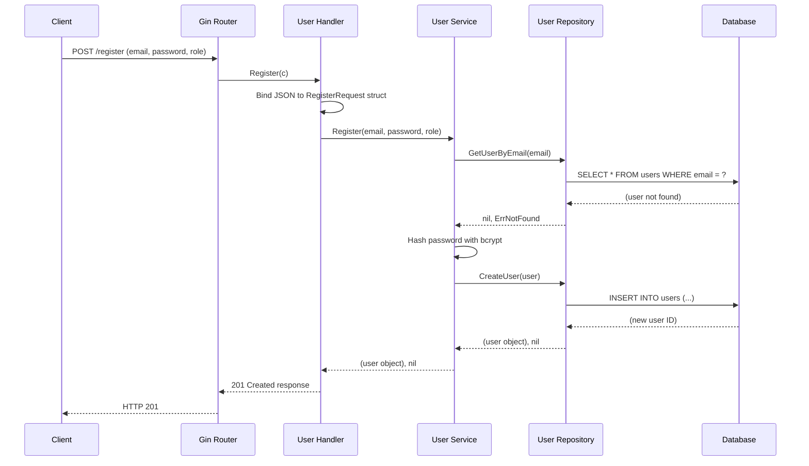
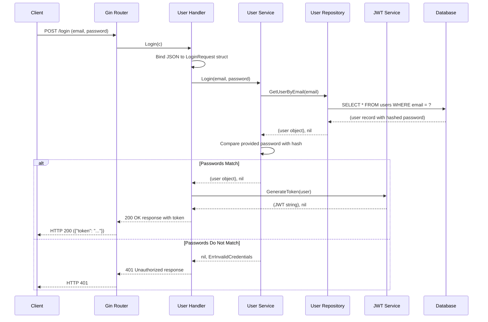
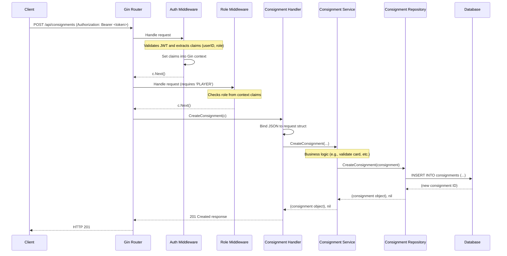

# Sequence Diagrams

This document contains sequence diagrams illustrating the key interaction flows within the `card-manage` application. These diagrams are written in Mermaid syntax and help visualize how different components collaborate to fulfill a user request.

## 1. User Registration Flow

This diagram shows the process for a new user registering.

## 2. User Login Flow

This diagram illustrates how a user logs in and receives a JWT.

## 3. Create Consignment Flow (Protected Route)

This diagram shows a more complex flow for a protected endpoint. It includes authentication and role-based authorization middleware.

