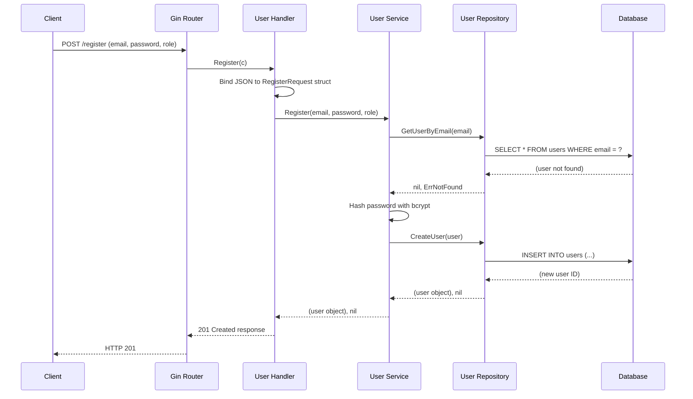
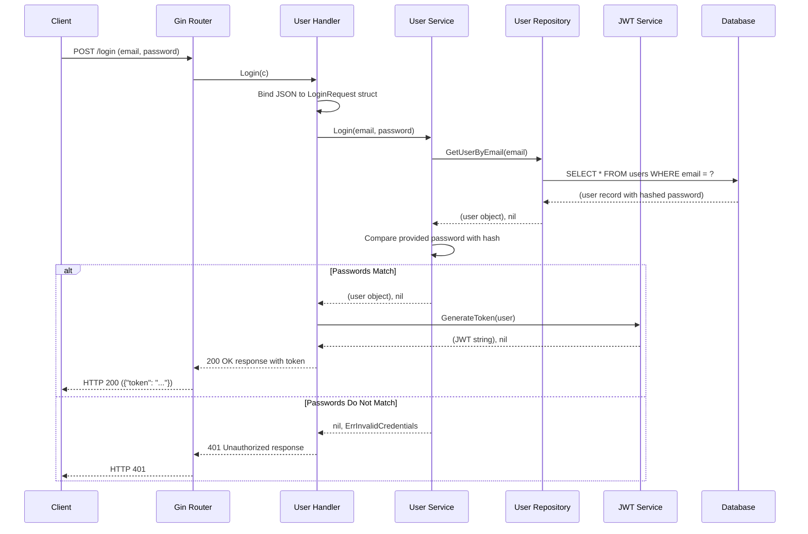
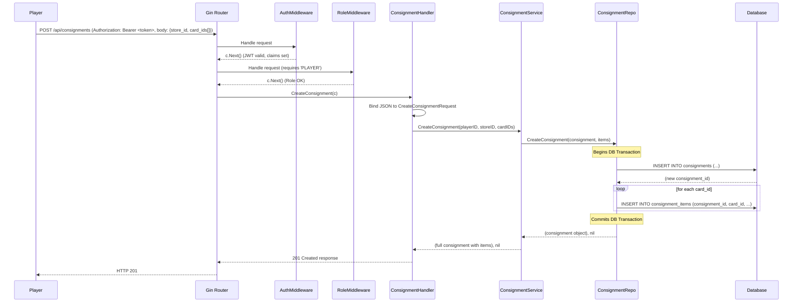
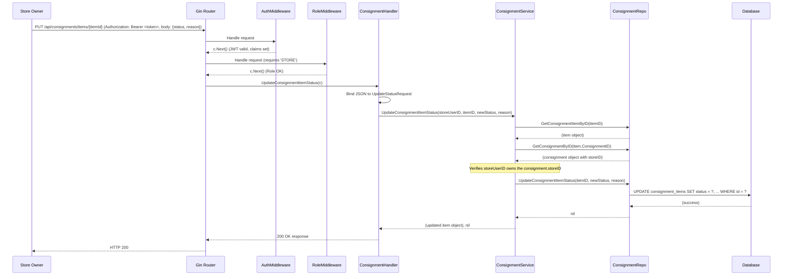

# Sequence Diagrams

This document contains sequence diagrams illustrating the key interaction flows within the `card-manage` application. These diagrams are written in Mermaid syntax and help visualize how different components collaborate to fulfill a user request.

## 1. User Registration Flow

This diagram shows the process for a new user registering.

## 2. User Login Flow

This diagram illustrates how a user logs in and receives a JWT.

## 3. Create Consignment Request Flow

This diagram shows a player creating a new consignment request with multiple items.

## 4. Update Consignment Item Status Flow

This diagram shows a store owner approving or rejecting an individual consignment item.

